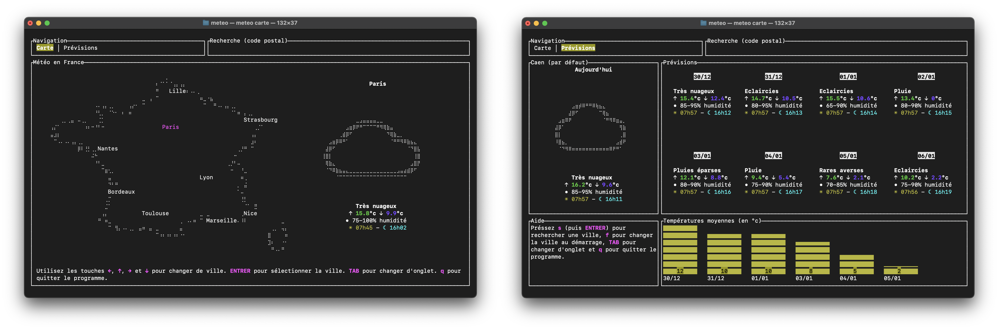

# Météo France TUI



Programme graphique en ligne de commande qui permet de consulter les prévisions de Météo France.

## Installation

Pour installer Météo TUI, téléchargez l'archive, rendez vous dans le dossier d'extraction depuis le terminal puis compilez et installez le programme à l'aide des commandes suivantes :

```bash
$ cargo install --path .
$ meteo
```

## Utilisation

Commandes possibles :

- `meteo` : ouvrir les prévisions météo de la ville par défaut.
- `meteo carte` : ouvrir les prévisions météo des principales villes de France.
- `meteo <code postal>` : ouvrir les prévisions météo d'une ville particulière.

Le programme se divise en deux onglets (navigation grâce à la touche TAB `⇥`) :

* `Carte` : onglet qui permet d'accéder rapidement aux prévisions météo des principales villes de France. Changer de ville est possible en utilisant les flèches du clavier.
* `Prévisions` : onglet permettant de visualiser les prévisions météo détaillées d'une ville précise. Les prévisions sont disponibles jusqu'à 8 jours dans le futur. Chaque prévision comprend le temps, les températures maximales et minimales, le pourcentage d'humidité et les heures de lever/coucher du soleil.

## Dépendances

Le programme utilise les dépendances suivantes :

- [Serde JSON](https://github.com/serde-rs/json) pour transformer les données Météo France en structures Rust.
- [Reqwest](https://github.com/seanmonstar/reqwest) pour exécuter des requêtes HTTP et récupèrer le contenu de pages web.
- [Crossterm](https://github.com/crossterm-rs/crossterm) et [tui-rs](https://github.com/fdehau/tui-rs) pour l'interface utilisateur dans le terminal.
- [Confy](https://github.com/rust-cli/confy) pour sauvegarder la configuration du programme.  
- [Chrono](https://github.com/chronotope/chrono) pour la manipulation des dates et des heures.

Amélioration à envisager :

- Connaître les précipitations dans l'heure.
- Trouver un moyen d'accélérer le démarrage. Pour l'instant le programme prend beaucoup de temps car il doit exécuter 8 requêtes HTTP avant l'ouverture (les prévisions des 7 villes de la carte et de la ville par défaut). Peut-être envisager un lancement asynchrone des requêtes internet.

**API - Météo France**

> Les données Météo France sont récupérables depuis leur API caché `webservice.meteofrance.com`. J'ai trouvé un jeton de connexion depuis le code de source de l'application Geometric Weather (sous licence GPL, [dispo ici](https://github.com/WangDaYeeeeee/GeometricWeather)).

